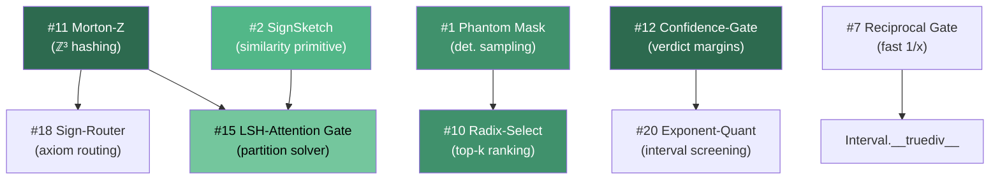

# Quake-Style Optimizations × CoAI Operandics — Cross-Reference v2

> Updated against the **corrected, unified, de-duplicated** 24-item suite.
> Adds **Scope** (Kernel / System) and **Ship Class** (Prod / Research / No-Go) per item.

## Summary

Of 24 techniques, **8 directly apply**, **4 transfer conceptually**, **12 are neural-specific** (N/A).

```
 Direct ████████░░░░░░░░░░░░░░░░  8 / 24
 Adapt  ████░░░░░░░░░░░░░░░░░░░░  4 / 24
 N/A    ████████████░░░░░░░░░░░░ 12 / 24
```

---

## Tier 1 — Directly Applicable

### #11 · Morton-Z → ℤ³ Dimension Hashing

| | |
|---|---|
| **Scope** | Kernel |
| **Ship class** | **Prod** |
| **CoAI target** | `grounding/dim_constraints.py` — dimension registry |
| **Mapping** | Our dimensions *are* ℤ³ integer triples `(M, T, I)`. Morton-interleave into a single 64-bit key for O(1) dict lookup, set membership, and locality-preserving ordering. Bijective — no information loss. |
| **Effort** | Low — add `Dimension.__hash__` using Morton encoding |

```python
def morton_z3(m, t, i, offset=128):
    um, ut, ui = m + offset, t + offset, i + offset
    key = 0
    for bit in range(8):
        key |= ((um >> bit) & 1) << (3*bit)
        key |= ((ut >> bit) & 1) << (3*bit + 1)
        key |= ((ui >> bit) & 1) << (3*bit + 2)
    return key
```

---

### #12 · Confidence-Gate (Logit-Margin) → Gate Verdict Margins

| | |
|---|---|
| **Scope** | System |
| **Ship class** | **Prod** |
| **CoAI target** | `grounding/sentinel.py` — all 6 gates |
| **Mapping** | The corrected item uses float margins with a bound formula. We adapt this directly: compute the *gap* between observed metric and threshold. A large positive margin → high-confidence PASS. A near-zero margin → PASS-with-warning. Provides staged rollout observability. |
| **Formula adaptation** | Gate 4 Quad-Goal: `margin = (comp_energy.lo − cost.hi) / comp_energy.lo`. Gate 3: `margin = 1.0 − (errors / checked)`. |
| **Effort** | Low |

---

### #1 · Phantom Mask → Deterministic Conjecture Sampling

| | |
|---|---|
| **Scope** | Kernel |
| **Ship class** | **Prod** |
| **CoAI target** | `discovery/engine.py`, `discovery/saturator.py` |
| **Mapping** | Replace `random.sample()` with SplitMix64 keyed on `(seed, cycle, axiom_index)`. Guarantees fully deterministic, reproducible conjecture generation without carrying RNG state. Partially achieved by our existing coverage-sample fix; this completes it. |
| **Effort** | Low |

---

### #10 · Radix-Select → Top-k Conjecture Ranking

| | |
|---|---|
| **Scope** | Kernel |
| **Ship class** | **Prod** |
| **CoAI target** | `discovery/engine.py` — `rank_by_interestingness()` |
| **Mapping** | Float-flip transform + radix select for exact top-k. Our pool is ~200 conjectures (small), so the win is correctness/branchlessness more than raw speed. Scales cleanly if pool grows. |
| **Effort** | Low |

---

### #2 · SignSketch Primitive → Axiom Similarity Proxy

| | |
|---|---|
| **Scope** | Kernel |
| **Ship class** | **Research** |
| **CoAI target** | `discovery/engine.py` — conjecture deduplication |
| **Mapping** | The unified SignSketch is the *building block*. We compute b-bit sketches of axiom ASTs by hashing (node_type, arity, sort) into sign bits. Hamming distance gives a fast similarity proxy before expensive structural comparison. Not a complexity win alone (our pool is small), but it's the primitive that enables #15-style bucketing if the axiom set scales. |
| **Effort** | Medium |

---

### #15 · LSH-Attention Gate → Axiom Partition Routing

| | |
|---|---|
| **Scope** | System |
| **Ship class** | **Research** |
| **CoAI target** | `grounding/dim_constraints.py` — constraint checking at scale |
| **Mapping** | The corrected item emphasizes that the *bucketing* is the complexity win, not the sketch alone. For Gate 3, if axiom sets grow to thousands, we can bucket axioms by dimension-signature hash (Morton key from #11) and only check constraints within + across adjacent buckets. This is the system-level analog of LSH-Attention: route axioms to solver partitions instead of running the full Gaussian elimination globally. |
| **Effort** | Medium-High |

---

### #19 · Infinity-Mask → Branchless Constraint Checks

| | |
|---|---|
| **Scope** | Kernel |
| **Ship class** | **Prod** |
| **CoAI target** | `grounding/dim_constraints.py` — Gaussian elimination |
| **Mapping** | Branchless predication for pivot selection and row-reduction. In the ℤ³ solver, zero/nonzero detection and sign handling can use sign-extension masks. Most impactful if we port the solver to NumPy/C. |
| **Effort** | Medium (requires native port) |

---

### #7 · Reciprocal Gate → Fast Interval Division

| | |
|---|---|
| **Scope** | Kernel |
| **Ship class** | **Research** |
| **CoAI target** | `grounding/intervals.py` — future `Interval.__truediv__` |
| **Mapping** | If we add interval division, the seed+1-NR pattern accelerates the reciprocal bound computation. Marginal in Python; meaningful if we port interval propagation to native for large-scale Gate 4 telemetry. |
| **Effort** | Low (Python) / Medium (native) |

---

## Tier 2 — Conceptually Transferable

### #24 · Fractal-Stack → Incremental Theorem Digest

| | |
|---|---|
| **Scope** | System |
| **Ship class** | **Research** |
| **Principle** | Fixed-size streaming summary of unbounded history |
| **Mapping** | The corrected version emphasizes *additive/decayed multi-timescale levels* over XOR. Our discovery engine accumulates theorems across cycles. An additive-decay Bloom sketch could track "explored territory" without storing full history, preventing re-derivation. The hybrid design (exact recent window + lossy far-past) directly parallels our `discovery/engine.py` cumulative session. |

---

### #6 · Bit-Mask Norm → Fast Interval Normalization

| | |
|---|---|
| **Scope** | Kernel |
| **Ship class** | **Research** |
| **Principle** | Replace RMS with `mean(|x|) × calibration_constant` |
| **Mapping** | `Interval.relative_uncertainty()` divides by `2·|midpoint|`. For batch validation of many measurements, a mean-abs proxy avoids the division. Only useful at scale (hundreds of measurements). |

---

### #18 · Sign-Router → Hash-Based Axiom Routing

| | |
|---|---|
| **Scope** | System |
| **Ship class** | **Research** |
| **Principle** | Route inputs to specialists via hash |
| **Mapping** | Partition axioms into specialist groups by dimension signature (Morton key from #11). Gate 3 then checks only the relevant partition. The corrected version notes that hash routing needs balancing — in our context, axiom partitions should have roughly equal sizes for solver efficiency. |

---

### #20 · Exponent-Quant → Interval Compression

| | |
|---|---|
| **Scope** | System |
| **Ship class** | **Research** |
| **Principle** | E8M0-like power-of-two binning for storage compression |
| **Mapping** | If Gate 4 ingests telemetry from production (thousands of `ModuleMeasurement`s), exponent-only binning gives order-of-magnitude screening at 8 bits per bound. Two-tier: coarse exponent sketch for fast triage, full precision loaded on-demand for audit. The corrected version's caveat ("too lossy for KV") maps to "too lossy for final audit, fine for screening." |

---

## Tier 3 — Not Applicable (Neural-Specific)

| # | Technique | Why N/A |
|---|-----------|---------|
| 3 | Mantissa-Step | No gradient descent in symbolic engine |
| 4 | Shift-Max | No softmax (could apply to future interval `exp()`, see note below) |
| 5 | Log-Add Core | No matrix multiplication; marked **incorrect** anyway |
| 8 | Holographic Embed | No embedding tables |
| 9 | Table-Add Core | No LNS matmul path |
| 13 | Binary-RoPE | No positional encoding |
| 14 | Sigmoid-Shift | No neural activations |
| 16 | Exponent-Clip | No distributed training |
| 17 | Polarity-Dropout | No neural regularization |
| 21 | Chaos-Sample | Reproducibility is a *requirement* for proofs |
| 22 | Decay-Shift | No weight decay; marked **fragile** anyway |
| 23 | Ghost-Momentum | No optimizer states; marked **broken in practice** |

> **Note on #4 (Shift-Max):** If we add temperature-dependent Landauer calculations
> to Gate 4 (e.g. `kT·ln(2)` at varying `T`), a fast `exp()` seed would apply.
> Currently no hot-path `exp()` exists.

---

## Implementation Priority Matrix

| Pri | # | Technique | CoAI Target | Scope | Ship | Effort |
|-----|---|-----------|-------------|-------|------|--------|
| **P0** | 11 | Morton-Z | ℤ³ dim hashing | Kernel | Prod | Low |
| **P0** | 12 | Confidence-Gate | Gate verdict margins | System | Prod | Low |
| **P1** | 1 | Phantom Mask | Deterministic sampling | Kernel | Prod | Low |
| **P1** | 10 | Radix-Select | Top-k conjectures | Kernel | Prod | Low |
| **P2** | 2 | SignSketch | Axiom similarity primitive | Kernel | Research | Med |
| **P2** | 19 | Infinity-Mask | Branchless solver | Kernel | Prod | Med |
| **P3** | 15 | LSH-Attention Gate | Axiom partition routing | System | Research | High |
| **P3** | 7 | Reciprocal Gate | Interval division | Kernel | Research | Med |

---

## Dependency Graph



> Green intensity = implementation priority (darker = higher)
