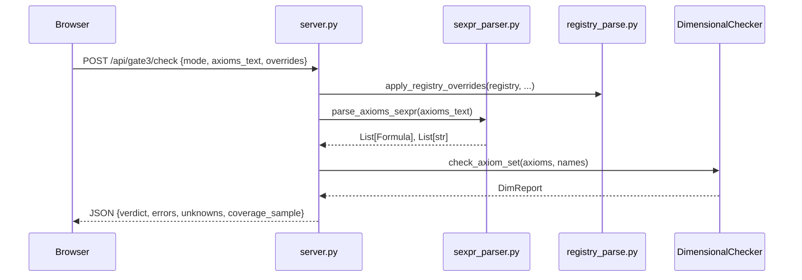

# CoAI Gate 3 Web Application — Architecture

## Overview

```
┌─────────────────────────────────────────────────────────┐
│  Browser (index.html)                                   │
│  ┌───────────┐  ┌────────────┐  ┌────────────────────┐  │
│  │ Mode      │  │ S-expr     │  │ Registry Overrides │  │
│  │ Selector  │  │ Editor     │  │ (JSON)             │  │
│  └─────┬─────┘  └─────┬──────┘  └─────────┬──────────┘  │
│        └──────────────┼────────────────────┘             │
│                       ▼                                  │
│              POST /api/gate3/check                       │
└───────────────────────┬─────────────────────────────────┘
                        ▼
┌─────────────────────────────────────────────────────────┐
│  FastAPI Backend (server.py)                             │
│  ┌──────────────┐  ┌──────────────┐  ┌───────────────┐  │
│  │ sexpr_parser │  │ registry_    │  │ Dimensional   │  │
│  │ .py          │  │ parse.py     │  │ Checker       │  │
│  │ S-expr → AST │  │ str → Dim   │  │ (Gate 3)      │  │
│  └──────┬───────┘  └──────┬───────┘  └───────┬───────┘  │
│         └─────────────────┼───────────────────┘          │
│                           ▼                              │
│                    JSON Response                         │
└─────────────────────────────────────────────────────────┘
```

---

## File Manifest

| File | Purpose |
|------|---------|
| `web/__init__.py` | Package marker |
| `web/index.html` | Browser UI (single-page) |
| `web/server.py` | FastAPI routes + Gate 3 orchestration |
| `web/sexpr_parser.py` | S-expression tokenizer/parser → `core.logic` AST |
| `web/registry_parse.py` | Dimension-string lookup + registry override helper |

---

## `index.html` — Frontpage Sections

```html
<!-- ═══════════════════════════════════════════════════ -->
<!-- SECTION 1: Mode Selector                            -->
<!-- Purpose: Choose between "one-off" (user axioms      -->
<!--          only) or "engine" (load 55 engine axioms   -->
<!--          + optional extras). Also sets coverage     -->
<!--          sample size for the report.                -->
<!-- ═══════════════════════════════════════════════════ -->
<select id="mode"> ... </select>
<input  id="sampleN" type="number" />

<!-- ═══════════════════════════════════════════════════ -->
<!-- SECTION 2: S-expression Axiom Editor                -->
<!-- Purpose: Free-text area where the user types axioms -->
<!--          in Lisp-like S-expression syntax.          -->
<!--          Supports: forall, exists, =, <=, implies,  -->
<!--          and, or, not, plus, times, divide.         -->
<!--          Lines starting with ; are comments.        -->
<!-- ═══════════════════════════════════════════════════ -->
<textarea id="axioms"> ... </textarea>

<!-- ═══════════════════════════════════════════════════ -->
<!-- SECTION 3: Registry Overrides                       -->
<!-- Purpose: Two JSON textareas that let the user       -->
<!--          override the default DimensionRegistry:    -->
<!--   constOverrides — map constant names to dims       -->
<!--     e.g. {"LANDAUER":"J/bit","MY_TEMP":"dimensionless"} -->
<!--   funcOverrides  — map function symbols to output dims  -->
<!--     e.g. {"ResourceCost":"J","Risk":"dimensionless"}    -->
<!-- ═══════════════════════════════════════════════════ -->
<textarea id="constOverrides"> ... </textarea>
<textarea id="funcOverrides"> ... </textarea>

<!-- ═══════════════════════════════════════════════════ -->
<!-- SECTION 4: Results Panel                            -->
<!-- Purpose: Displays the Gate 3 verdict (PASS/FAIL/    -->
<!--          UNKNOWN) with color coding and the full    -->
<!--          JSON report from the backend.              -->
<!-- ═══════════════════════════════════════════════════ -->
<div id="verdictLine"> ... </div>
<pre id="resultJson"> ... </pre>
```

### JavaScript Functions

| Function | Trigger | Purpose |
|----------|---------|---------|
| `setVerdict(v)` | After API response | Color-codes verdict: green=PASS, amber=UNKNOWN, red=FAIL |
| `loadDefaults()` | "Load default registry" button | Fetches `GET /api/gate3/defaults` and fills the JSON textareas |
| `btnCheck.click` | "Run Gate 3" button | Collects all inputs, `POST /api/gate3/check`, renders result |

---

## `server.py` — FastAPI Backend

### Routes

| Method | Path | Purpose |
|--------|------|---------|
| `GET` | `/` | Serves `web/index.html` |
| `GET` | `/api/gate3/defaults` | Returns the default `DimensionRegistry` as JSON (constant dims + function output dims) |
| `POST` | `/api/gate3/check` | Main endpoint — parses axioms, runs Gate 3 checker, returns report |

### `Gate3CheckRequest` (Pydantic model)

```python
class Gate3CheckRequest(BaseModel):
    mode: str                    # "oneoff" or "engine"
    axioms_text: str             # Raw S-expression text from the textarea
    const_overrides: Dict[str,str]  # {"CONST_NAME": "J"|"bit"|...}
    func_overrides: Dict[str,str]   # {"FuncName": "J"|"bit"|...}
    coverage_sample_n: int       # How many unknown vars to sample in report
```

### `gate3_check()` — Orchestration Flow

```
1. Build DimensionRegistry
2. Apply user overrides (const_overrides, func_overrides)
3. Create DimensionalChecker(registry)
4. Parse axioms_text → List[Formula] via sexpr_parser
5. If mode == "engine":
     Load engine axioms from CoAIOperandicsExplorer
     Prepend to user axioms
6. checker.check_axiom_set(axioms, names)
7. Normalize DimReport → JSON-safe dict
8. Return {verdict, errors, unknowns, coverage_sample, ...}
```

---

## `sexpr_parser.py` — S-expression → AST

### Pipeline

```
Raw text → tokenize() → parse_sexp() → formula() → core.logic AST
```

### Functions

| Function | Input | Output | Purpose |
|----------|-------|--------|---------|
| `tokenize(s)` | Raw string | `List[Token]` | Inserts spaces around parens, strips `;` comments, splits into tokens |
| `parse_sexp(tokens)` | Token list | `(Sexp, remaining)` | Recursive descent: atoms become strings, `(...)` becomes nested lists |
| `parse_many(s)` | Raw string | `List[Sexp]` | Parses all top-level S-expressions from the input |
| `sort_from_str(x)` | `"MODULE"` etc. | `core.logic.Sort` | Maps sort name strings to sort objects |
| `term(node, env)` | Sexp + bound vars | `Term` | Converts atoms to `Variable` (if bound) or `Constant`; lists to `Function` |
| `formula(node, env)` | Sexp + bound vars | `Formula` | Dispatches on head symbol: `=`→`Equality`, `<=`→`LessEq`, `forall`→`Forall`, etc. |
| `parse_axioms_sexpr(text)` | Raw text | `(axioms, names)` | Top-level entry point; returns list of `Formula` objects + auto-generated names |

### Supported S-expression Forms

```lisp
(= term term)                    → Equality
(<= term term)                   → LessEq
(not formula)                    → Not
(and formula formula)            → And
(or formula formula)             → Or
(implies formula formula)        → Implies
(forall (VAR SORT) formula)      → Forall (creates scoped Variable)
(exists (VAR SORT) formula)      → Exists
(func arg1 arg2 ...)             → Function / Atom (fallback)
SYMBOL                           → Constant (if unbound) or Variable (if bound)
```

---

## `registry_parse.py` — Dimension String Helpers

### Functions

| Function | Purpose |
|----------|---------|
| `parse_dim_string(s)` | Maps human-readable strings (`"J"`, `"bit"`, `"J/bit"`, `"dimensionless"`, `"s"`) to `Dimension` objects |
| `apply_registry_overrides(reg, const_over, func_over)` | Mutates a `DimensionRegistry` by inserting/replacing entries from the user's JSON overrides |

### Supported Dimension Strings

| String | Maps to |
|--------|---------|
| `"dimensionless"` / `"DIMENSIONLESS"` | `DIMENSIONLESS` (ℤ³ = [0,0,0]) |
| `"J"` / `"ENERGY"` | `ENERGY` ([1,0,0]) |
| `"s"` / `"TIME"` | `TIME` ([0,1,0]) |
| `"bit"` / `"BITS"` | `BITS` ([0,0,1]) |
| `"J/bit"` / `"ENERGY_PER_BIT"` | `ENERGY_PER_BIT` ([1,0,−1]) |

---

## Data Flow (End-to-End)


